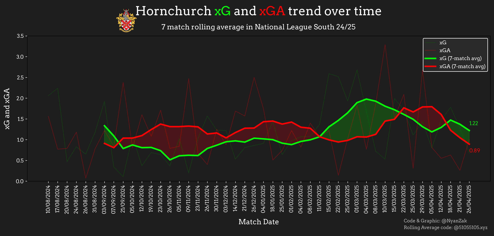

# Rolling xG and xGA Trend Visualization Manual (Single Season)

## Overview
This project uses a spreadsheet of data to generate a visualization of a football team's expected goals (xG) and expected goals against (xGA) over the course of a single season using rolling averages. 

## Features

- One-season rolling trend visualization
- Rolling average of xG and xGA (default 7-match window)
- Usable for teams outside the top 14 leagues
- Color shading for xG > xGA (green) and xGA > xG (red)
- Custom team branding (font + logo)
- Key event annotations (e.g., manager hire)
- Output saved as high-resolution PNG


## Getting Started

## Prerequisites

- Python 3.8+
- `pandas`
- `matplotlib`
- `highlight_text`
- `requests`

Install missing packages via pip:

```bash
pip install pandas matplotlib highlight_text requests
```

## Configuration

You can easily adapt this notebook for any team by changing the following variables at the top of the script:

```python
teamname = "Hornchurch"
leaguename = "National League South"
season = "2024-2025"
rollingavg = 7
```

You’ll also need:
- XLSX with the Dates, xG and XGA
- Local paths for:
  - A team logo image (PNG)
  - A font file (e.g., Arvo-Regular.ttf)

## Output
The script produces a PNG visualization showing:

- Match-by-match xG and xGA
- Rolling average trends
- Highlighted areas where xG exceeds xGA (green) or xGA exceeds xG (red)
- Optional annotations (e.g., managerial changes)

## Example Output




## Attribution

Rolling average visualization technique inspired by [@51055105.xyz](https://bsky.app/profile/51055105.xyz).

**Note:** This notebook uses Hornchurch as an example, but can be adapted to any team by changing the input variables and URLs.
